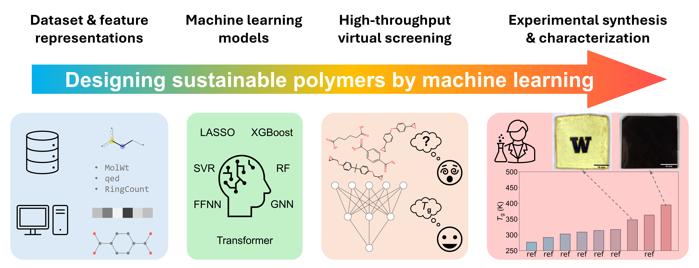

# VitrimerScreening
Codes and data used in the paper: Toward Sustainable Polymer Design: A Molecular Dynamics-Informed Machine Learning Approach for Vitrimers https://arxiv.org/abs/2503.20956
 
 

## Requirements
The codes are tested in a Python 3.10.15 environment containing the following packages:
 - RDKit (2024.3.5)
 - Mol2vec (0.1) https://github.com/samoturk/mol2vec
 - Mordred (2.0.6) https://github.com/mordred-descriptor/mordred
 - scikit-learn (1.5.1)
 - XGBoost (2.1.2) https://xgboost.readthedocs.io/en/stable/
 - PyTorch (2.2.0)
 - PyTorch Geometric (2.6.1)
 - TransPolymer https://github.com/ChangwenXu98/TransPolymer/tree/master
 - shap (0.46.0) https://github.com/shap/shap

## Data
 - `data/labeled.csv`: 8,424 vitrimers from ZINC15 with MD-calculated *T*g
 - `data/labeled_train.csv`: labeled training set
 - `data/labeled_test.csv`: labeled test set
 - `data/unlabeled.csv`: 991,576 vitrimers from ZINC15
 - `data/unlabeled_synthesis`: 259 vitrimers from Sigma-Aldrich

The first two datasets are sourced from our previous work https://github.com/vashisth-lab/VitrimerVAE

## Preprocess data
 - `python split.py`: split 90/10 training/test sets
 - `python proprecess_fp.py`: convert vitrimer repeating unit into Morgan fingerprints
 - `python proprecess_mol2vec.py`: convert vitrimer repeating unit into mol2vec embeddings
 - `python proprecess_rdkit.py`: convert vitrimer repeating unit into RDKit descriptors
 - `python proprecess_mordred.py`: convert vitrimer repeating unit into Mordred fingerprints
 - `python proprecess_graph.py`: convert vitrimer repeating unit into graph tensors

## Training and evaluating models
 - `python lasso.py [feature]`: train the LASSO model using a certain feature (`fp`, `mol2vec`, `rdkit`, `mordred`) and evaluate the trained model on the test set
 - `python rf.py [feature]`: train the random forest model using a certain feature and evaluate the trained model on the test set
 - `python svr.py [feature]`: train the support vector regression model using a certain feature and evaluate the trained model on the test set
 - `python xgb.py [feature]`: train the XGBoost model using a certain feature and evaluate the trained model on the test set
 - `python ffnn.py [feature]`: train the FFNN model using a certain feature and evaluate the trained model on the test set
 - `python gnn.py`: train the GNN model using a certain feature and evaluate the trained model on the test set
 - `python transpolymer.py`: train the Transformer model using a certain feature and evaluate the trained model on the test set
 - `python ensemble.py`: evaluate the ensemble model (i.e., averaging predictions from different models) on the test set

The GNN is based on https://data.mendeley.com/datasets/ydbv9t8fzr/1 and Transformer is based on https://github.com/ChangwenXu98/TransPolymer/tree/master

## SHAP analysis
 - `python importance.py [model] [feature] [fold]`: evaluate feature importance on a trained model (`lasso`, `rf`, `xgboost`) with fold (`1`, `2`, `3`, `4`, `5`) using a certain feature (`fp`, `rdkit`, `mordred`)
 - `python importance_ffnn.py [feature] [fold]`: evaluate feature importance on a trained FFNN model with fold (`1`, `2`, `3`, `4`, `5`) using a certain feature (`fp`, `rdkit`, `mordred`)

## Predicting *T*g of unlabeled datasets
 - `python xgb_pred.py [feature]`: predict *T*g of unlabeled datasets using the trained XGBoost model
 - `python gnn_pred.py`: predict *T*g of unlabeled datasets using the trained GNN model
 - `python transpolymer_pred.py`: predict *T*g of unlabeled datasets using the trained Transformer model
 - `python ensemble_pred.py`: predict *T*g of unlabeled datasets using the ensemble model

## Molecular dynamics validation
 - `MD/tg_low.csv`: MD-calculated *T*g of 97 vitrimers with lowest predicted *T*g
 - `MD/tg_high.csv`: MD-calculated *T*g of 113 vitrimers with highest predicted *T*g
 - `MD/tg_calibrated_low.csv`: MD values calibrated by a GP model
 - `MD/tg_calibrated_high.csv`: MD values calibrated by a GP model
 
The codes for calibration are sourced from our previous work https://github.com/vashisth-lab/VitrimerVAE?tab=readme-ov-file#calibration
